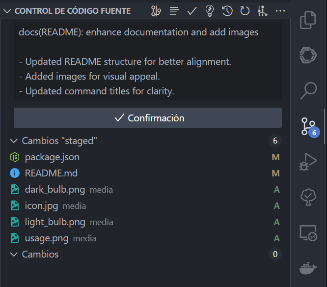

<div align="center">
  
  
  # 🤖 Conventional Commit AI
  A VSCode extension that leverages AI to automatically generate commit messages following the [Conventional Commits](https://www.conventionalcommits.org/) standard.
</div>

## ✨ Features

- 🎯 Generates clear and structured commit messages
- 🔄 Seamless integration with Git SCM
- 🎨 Customizable OpenAI parameters
- 📝 Support for custom prompts
- 🌈 Colored terminal output for better debugging
- 🔒 Secure API key storage

## 🛠️ Requirements

- Visual Studio Code 1.93.0 or higher
- Git installed on your system
- OpenAI API key ([Get one here](https://platform.openai.com/))

## 📦 Installation

1. Install the extension from the [VSCode Marketplace](https://marketplace.visualstudio.com/)
2. Set your OpenAI API key using the command palette (`Ctrl/Cmd + Shift + P`):
   - Search for "Set OpenAI Key"
   - Enter your API key when prompted

## 🚀 Usage

1. Stage your changes in Git
2. Click the "Create Commit With AI" button in the Source Control view
3. The extension will analyze your changes and generate a commit message
4. Review and adjust the generated message if needed
5. Commit as usual

## ⚙️ Configuration

Access settings through VSCode's settings (`Ctrl/Cmd + ,`):

| Setting | Description | Default |
|---------|-------------|---------|
| `conventional-commit-ai.openAiApiKey` | Your OpenAI API key | `null` |
| `conventional-commit-ai.openAiModel` | OpenAI model to use | `gpt-4o-mini` |
| `conventional-commit-ai.openAiTemperature` | Controls randomness (0-2) | `0.7` |
| `conventional-commit-ai.openAiMaxToken` | Maximum tokens per request | `1000` |
| `conventional-commit-ai.customPrompt` | Custom prompt for commit generation | `""` |
| `conventional-commit-ai.commitLanguage` | Language for the commit messages (English, Español, Français) | `English` |

## 🔍 Commands

- `Conventional Commit AI: Set OpenAI Key` - Configure your OpenAI API key
- `Conventional Commit AI: Delete OpenAI Key` - Remove stored API key
- `Conventional Commit AI: Create Commit` - Generate a commit message

## 📝 Example Output
```
feat(user): add user creation functionality
- Added createUser method to UserService
```

## 🐛 Troubleshooting

Check the extension output panel for detailed logs:
1. Open Command Palette (`Ctrl/Cmd + Shift + P`)
2. Type "Developer: Show Output"
3. Select "Conventional Commit AI" from the dropdown

## 🤝 Contributing

Contributions are welcome! Please feel free to submit a Pull Request.

## 📄 License

This project is licensed under the MIT License - see the [LICENSE](LICENSE) file for details.

## 💖 Support

If you find this extension helpful, please consider:
- ⭐ Starring the repository
- 🐛 Reporting issues
- 💡 Suggesting new features

---

Made with ❤️ by [LomitoDev](https://github.com/LomitoDev)
<!-- Para badges, usa proveedores confiables como shields.io -->

